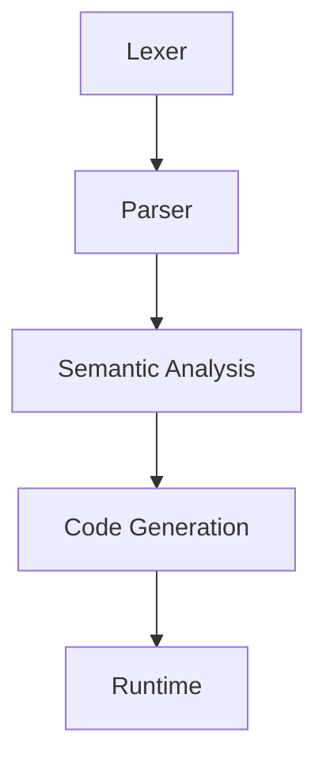
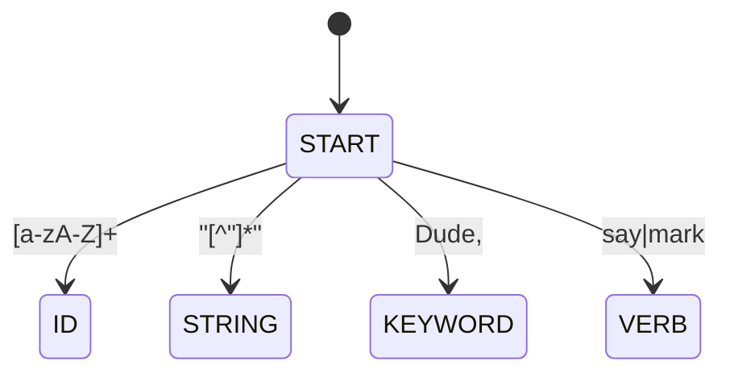
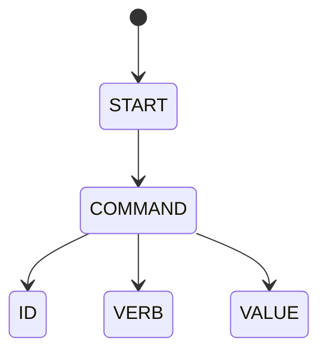

<div align="center">

  <h1>The Making of Dudelang</h1>
  <h3>01: That's a great plan, Walter</h3>

</div>

## Prompt

You are an experienced software developer, specializing in designing and implementing new programming languages.

Your task is to provide guidance, advice, and best practices for creating a new programming language, including syntax design, compiler construction, and language features.

The language we will be creating is called "Dudelang", and is an esoteric programming language designed around the movie "The Big Lebowski".

The language will incorporate themes, characters, and quotes from "The Big Lebowski" into its syntax and semantics, creating a unique and humorous programming experience.

For instance, "Hello world" in Dudelang would look like this:

```text
DUDE, SAY "Hello world"
```

And declaring a string variable would look like this:

```text
DUDE, MARK i "Hello world"
```

Combining the two would be:

```text
DUDE, MARK i "Hello world"
DUDE, SAY i
```

What would you suggest we do to create such a language?

## Response

I'll help you create Dudelang! Let's break this down into key components:

1. **Language Design**
2. **Toolchain Development**
3. **Documentation**

### 1. Language Design

First, let's define the core syntax elements based on your examples:

Dude -> "say" | "mark"
sayCommand --> "Dude, say" + stringLiteral
markCommand --> "Dude, mark" + identifier + stringLiteral

Key features:

- Commands start with `Dude,`
- Two main verbs: `say` (output) and `mark` (assign)
- Variables are named using identifiers after `mark`
- String literals use double quotes

### 2. Toolchain Development

We'll create a minimal viable toolchain:



#### File Structure Suggestion:

```text
src/
├── dudelang/
│   ├── lexer.py  # Tokenizer implementation
│   ├── parser.py # Grammar rules and AST generation
│   ├── semantics.py # Type checking and symbol resolution
│   ├── codegen.py # Generate bytecode or intermediate representation 
│   └── runtime.py # Virtual machine execution
```

#### Implementation Steps:

1. **Lexer (src/dudelang/lexer.py)**



2. **Parser (src/dudelang/parser.py)**



3. **Runtime (src/dudelang/runtime.py)**

```python
class DudelangVM:
    def __init__(self):
        self.variables = {}
    
    def execute(self, ast_node):
        # Basic execution loop
        pass
```

### 3. Documentation

We should create comprehensive documentation in the docs folder:

1. **Language Specification (docs/spec.md)**
2. **Getting Started Guide (docs/guides/getting-started.md)**
3. **API Reference (docs/api/)**

Would you like me to proceed with implementing any of these components? I can start with either:

1. The lexer implementation
2. The parser specification
3. The language specification documentation

Let me know which part you'd like to focus on first!
